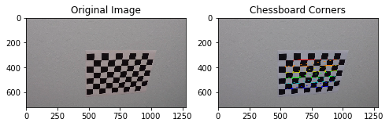
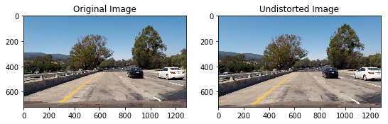
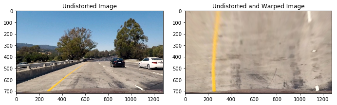
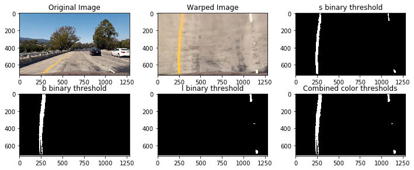
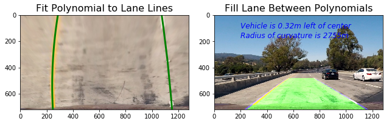

# Advanced Lane Finding Writeup

## Goal and steps of this project

The goal and steps of this project is to develop a pipeline to process a video stream from a forward-facing camera mounted on the front of a car, and output an annotated video which identifies:

* Compute the camera calibration matrix and distortion coefficients given a set of chessboard images.
* Apply a distortion correction to raw images.
* Use color transforms, gradients, etc., to create a thresholded binary image.
* Apply a perspective transform to rectify binary image ("birds-eye view").
* Detect lane pixels and fit to find the lane boundary.
* Determine the curvature of the lane and vehicle position with respect to center.
* Warp the detected lane boundaries back onto the original image.
* Output visual display of the lane boundaries and numerical estimation of lane curvature and vehicle position.

## Rubric Points

### Here I will consider the rubric points individually and describe how I addressed each point in my implementation.

---

### Writeup / README

#### 1. Provide a Writeup / README that includes all the rubric points and how you addressed each one.  You can submit your writeup as markdown or pdf.  

### Camera Calibration

#### 1. Briefly state how you computed the camera matrix and distortion coefficients. Provide an example of a distortion corrected calibration image.

The code for this step is contained in the function `undistort()` of the file called `advanced_lane_finding.py`.  I start by preparing "object points", which will be the (x, y, z) coordinates of the chessboard corners in the world. Here I am assuming the chessboard is fixed on the (x, y) plane at z=0, such that the object points are the same for each calibration image.  Thus, `objp` is just a replicated array of coordinates, and `objpoints` will be appended with a copy of it every time I successfully detect all chessboard corners in a test image.  `imgpoints` will be appended with the (x, y) pixel position of each of the corners in the image plane with each successful chessboard detection.  

I then used the output `objpoints` and `imgpoints` to compute the camera calibration and distortion coefficients using the `cv2.calibrateCamera()` function. In this step, I used the OpenCV functions `findChessboardCorners` and `drawChessboardCorners` to identify the locations of corners on a series of pictures of a chessboard taken from different angles.



I applied this distortion correction to the test image using the `cv2.undistort()` function and obtained this result: 



### Pipeline (single images)

#### 0. Pipeline overview

The pipeline is as follows:
* Distortion correction: calculated camera calibration matrix and distortion coefficients.
* Perspective transformation: a birds eye view.
* Color thresholds: create a binary image which isolates the pixels representing lane lines.
* Fit polynomials to the lane lines.
* Calculate curvature and vehicle position with respect to center.
* Warp the detected lane onto the original image.
* Output visual display of the lane boundaries.

#### 1. Provide an example of a distortion-corrected image.
To demonstrate this step, I will describe how I apply the distortion correction to one of the test images like this one:


#### 2. Describe how (and identify where in your code) you performed a perspective transform and provide an example of a transformed image.

Transform perspective is to transform the undistorted image to a "birds eye view" of the road the function `birds_eye()` is to achieve the perspective transformation. In this function, I used the OpenCV functions `getPerspectiveTransform` and `warpPerspective` which take a matrix of four source points on the undistorted image and remaps them to four destination points on the warped image. The source (`src`) and destination (`dst`) points were selected manually by visualizing the locations of the lane lines on a series of test images.

```
    src = np.float32([[490, 482],[810, 482],
                      [1250, 720],[40, 720]])
    dst = np.float32([[0, 0], [1280, 0], 
                     [1250, 720],[40, 720]])
```
I verified that my perspective transform was working as expected by drawing the `src` and `dst` points onto a test image and its warped counterpart to verify that the lines appear parallel in the warped image.




### 3. Describe how (and identify where in your code) you used color transforms, gradients or other methods to create a thresholded binary image.  Provide an example of a binary image result.


I chose to create a combined binary threshold based on the three above mentioned binary thresholds, to create one combination thresholded image which does a great job of highlighting almost all of the white and yellow lane lines.

I used the following color channels and thresholds to identify the lane lines:

- The S Channel from the HLS color space, with a min threshold of 180 and a max threshold of 255, did a fairly good job of identifying both the white and yellow lane lines, but did not pick up 100% of the pixels in either one, and had a tendency to get distracted by shadows on the road.
- The L Channel from the LUV color space, with a min threshold of 225 and a max threshold of 255, did an almost perfect job of picking up the white lane lines, but completely ignored the yellow lines.
- The B channel from the Lab color space, with a min threshold of 155 and an upper threshold of 200, did a better job than the S channel in identifying the yellow lines, but completely ignored the white lines. 

I used a combination of color and gradient thresholds to generate a binary image. Here's an example of my output for this step.  




#### 4. Describe how (and identify where in your code) you identified lane-line pixels and fit their positions with a polynomial?

The next step was to fit a polynomial to each lane line, which was done by:
- Identifying peaks in a histogram of the image to determine location of lane lines.
- Identifying all non zero pixels around histogram peaks using the numpy function `numpy.nonzero()`.
- Fitting a polynomial to each lane using the numpy function `numpy.polyfit()`.

After fitting the polynomials I was able to calculate the position of the vehicle with respect to center with the following calculations:
- Calculated the average of the x intercepts from each of the two polynomials `position = (rightx_int+leftx_int)/2`
- Calculated the distance from center by taking the absolute value of the vehicle position minus the halfway point along the horizontal axis `distance_from_center = abs(image_width/2 - position)`
- If the horizontal position of the car was greater than `image_width/2` than the car was considered to be left of center, otherwise right of center.
- Finally, the distance from center was converted from pixels to meters by multiplying the number of pixels by `3.7/700`.

#### 5. Describe how (and identify where in your code) you calculated the radius of curvature of the lane and the position of the vehicle with respect to center.

I did this in lines 188 through 195 in my code in `advanced_lane_finding.py`

#### 6. Provide an example image of your result plotted back down onto the road such that the lane area is identified clearly.

I implemented this step in lines 123 through 229 in my code in `advanced_lane_finding.py` in the function `find_lane()`to plot the polynomials on to the warped image, fill the space between the polynomials to highlight the lane that the car is in, use another perspective trasformation to unwarp the image from birds eye back to its original perspective, and print the distance from center and radius of curvature on to the final annotated image. Here is an example of my result on a test image:



---

### Pipeline (video)

#### 1. Provide a link to your final video output.  Your pipeline should perform reasonably well on the entire project video (wobbly lines are ok but no catastrophic failures that would cause the car to drive off the road!).

The final step was to expand the pipeline to process videos frame-by-frame. I created a class for each of the left and right lane lines and stored features of each lane for averaging across frames. I used the sliding window to check for lane pixels in close proximity to the polynomial calculated in the previous frame. The pipeline does not need to scan the entire image, and the pixels detected have a high confidence of belonging to the lane line. 


* Here's a [link to project_video output](./project_output.mp4)
* Here's a annoated challenge video [link to challenge_video output](./challenge_output.mp4)

---

### Discussion

#### 1. Briefly discuss any problems / issues you faced in your implementation of this project.  Where will your pipeline likely fail?  What could you do to make it more robust?
 
It is a robust video pipeline to detect lane lines in the test video and challenge video but some additional videos should be tested with varying environments, such as weather condition, road quality and lighting. 

